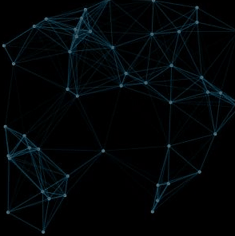
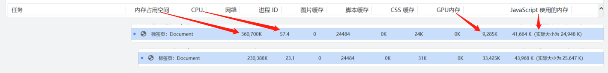

# 线条粒子效果插件 ( svg和canvas版本 )

### 

## 使用方法：支持浏览器，cmd,amd环境

```html
<div id="wraper" style="height: 300px; width: 300px;"> </div>

<script>
    let d = new DotLine({
        container: '#wraper',
        dotSum: 50,
    });
    // 开始动画
    d.start();
    // 结束动画
    d.end();
    // 默认参数option
    /* {
        // 容器选择器名称
        container: '#dotLine',
        // svg或者canvas的视图尺寸（注意：不是dom的尺寸，dom的尺寸100%）
        width: 1920,
        height: 1080,
        // 粒子数量
        dotSum: 100,
        // 粒子运动的最大速度（可以分别设置x,y的最大运动速度）
        speed: 1,
        speedx: null,
        speedy: null,
        // 允许建立连线的最大粒子距离
        maxLength: 100,
        // 粒子和线条的样式，请参考 <circle> <line>标签的属性进行设置
        dotStyle: { fill: 'gray', r: 2, },
        lineStyle: { stroke: "rgb(0,0,0)", 'stroke-width': 1 },
        // 背景色
        background: null,
        // 鼠标聚集效果
        mouseEffect: false,
        // 产生聚集效果的最大距离
        mouseDistance: 100,
    } */
    
</script>

```

### Svg版本：index.js

### Canvas版本：index-cancas.js

### 

